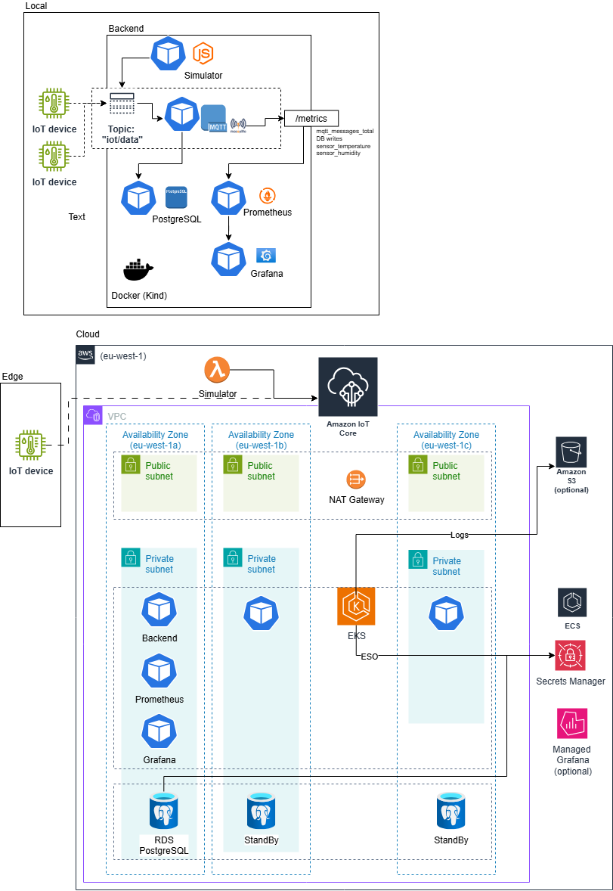

# ☁️ Cloud Assessment - IoT Data Collector System

IoT data collection system based on microservices with local and AWS cloud deployment.

## 📋 Overview

This project implements an IoT Data Collector system with:
- **Backend API** in Node.js
- **MQTT Broker** (Mosquitto local / AWS IoT Core cloud)
- **Database** PostgreSQL
- **Monitoring** with Prometheus and Grafana
- **Infrastructure as Code** with Terraform
- **Orchestration** with Kubernetes (Kind local / EKS cloud)

## 🚀 Quick Start

### 1. Check Prerequisites
```bash
# Check if Docker is running
docker info

# Check if kubectl is available
kubectl version --client

# Check if Helm is available
helm version

# Check if Kind is available (for local testing)
kind version

# Check if AWS CLI is configured (for cloud testing)
aws sts get-caller-identity
```

### 2. Local Test (Recommended for development)
```bash
# Run complete local test (Windows PowerShell)
./demo-testing/test-local.ps1
```

### 3. Cloud Test (AWS)
```bash
# Run complete cloud test (Linux/Mac)
./demo-testing/test-cloud.sh

# Run complete cloud test (Windows PowerShell)
./demo-testing/test-cloud.ps1
```

## 📁 Project Structure

```
cloud-assessment/
├── backend/                 # Node.js API
├── simulator/              # IoT Simulator
├── chart/                  # Helm charts
│   ├── templates/          # Kubernetes templates
│   ├── dashboards/         # Grafana JSON dashboards
│   │   ├── iot-dashboard.json
│   │   └── README.md
│   ├── values-local.yaml   # Local configuration
│   └── values-cloud.yaml   # AWS configuration
├── infrastructure/         # Infrastructure as code
│   └── terraform/         # Terraform for AWS
└── demo-testing/          # Test scripts
    ├── test-local.ps1     # Local test (Windows)
    ├── test-cloud.ps1     # Cloud test (Windows)
    ├── cleanup-local.ps1  # Cleanup (Windows)
    └── cleanup-cloud.ps1  # Cloud cleanup (Windows)
```

## 🛠️ Components

### Backend API
- **Port**: 3000
- **Metrics**: `/metrics` (Prometheus format)
- **Features**:
  - Receives MQTT data
  - Stores in PostgreSQL
  - Exposes metrics for monitoring

### MQTT Broker
- **Local**: Mosquitto (port 1883)
- **Cloud**: AWS IoT Core
- **Topic**: `iot/data`

### Database
- **Local**: PostgreSQL Docker
- **Cloud**: AWS RDS PostgreSQL
- **Schema**: IoT data table

### Monitoring
- **Prometheus**: Metrics collection
- **Grafana**: Visualization dashboards
- **Metrics**: MQTT messages, DB writes, system metrics

### Secrets Management
- **Local**: Kubernetes Secrets (manual creation)
- **Cloud**: External Secrets Operator (ESO) + AWS Secrets Manager
- **Features**: Automatic secret rotation and management

## Architecture




## 🔧 Configuration

### Local Prerequisites
- Docker
- kubectl
- Helm
- Kind (for local cluster)
- Node.js
- Git

### Cloud Prerequisites
- AWS CLI configured
- Terraform
- Adequate AWS permissions

## 📊 Monitoring

### Grafana Dashboards
- **MQTT Message Rate**: MQTT message rate
- **Database Writes**: Database writes
- **System Metrics**: System metrics

### Available Metrics
- `mqtt_messages_total`: Total MQTT messages
- `sensor_temperature`: Temperature metric example
- `sensor_humidity`: Humidity metric example
- `db_writes_total`: Total database writes
- `http_requests_total`: Total HTTP requests

## 🗑️ Cleanup

### Local
```bash
# Windows PowerShell
./demo-testing/cleanup-local.ps1
```

### Cloud
```bash
# Windows PowerShell
./demo-testing/cleanup-cloud.ps1
```

## 📚 Detailed Documentation

- [Cloud Test](demo-testing/README.md) - Complete cloud test documentation
- [Architecture](architecture.md) - Architecture diagrams and decisions
- [Deployment Guide](docs/DEPLOYMENT.md) - Step-by-step deployment instructions
- [Security & Monitoring](docs/SECURITY.md) - Security measures and monitoring strategies
- [CI/CD Pipeline](docs/CI-CD.md) - GitHub Actions workflow documentation
- [Terraform Infrastructure](infrastructure/terraform/README.md) - AWS infrastructure documentation
- [Grafana Dashboards](chart/dashboards/README.md) - Dashboard configuration

## 🔍 Troubleshooting

### Common Issues

#### Local
```bash
# Check if Docker is running
docker info

# Check Kind cluster
kind get clusters

# Check pods
kubectl get pods
```

#### Cloud
```bash
# Check AWS CLI
aws sts get-caller-identity

# Check EKS
aws eks list-clusters

# Check pods
kubectl get pods
```

## 💰 Cloud Costs

**Monthly AWS estimate**: ~$150-225
- EKS: ~$70-100
- RDS: ~$30-50
- VPC/NAT: ~$45
- Others: ~$5-30

## 📄 License

This project is part of a technical assessment by Mauro Pimentel for TII.
